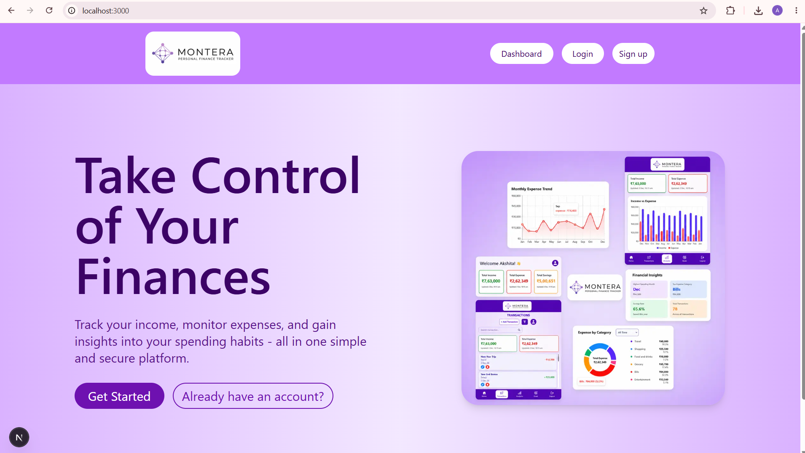
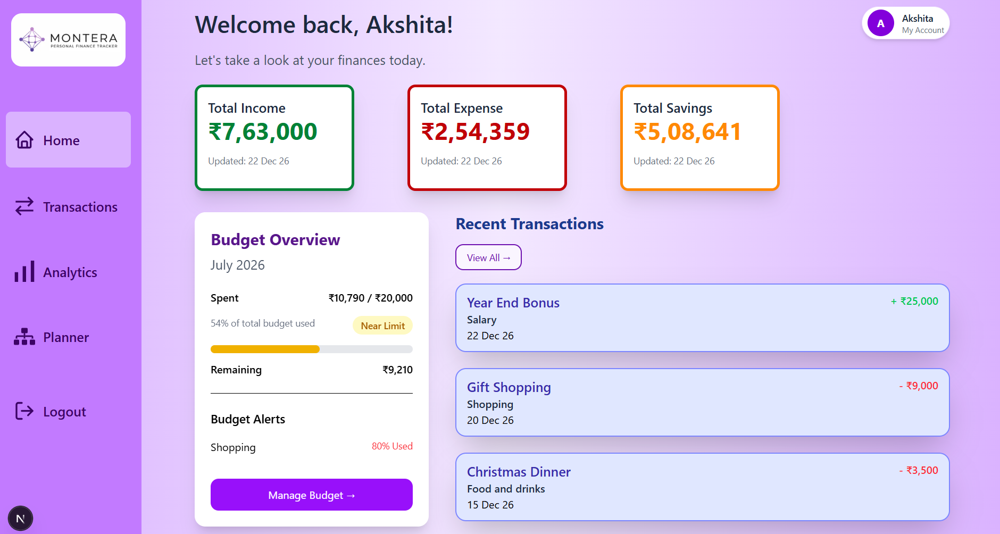
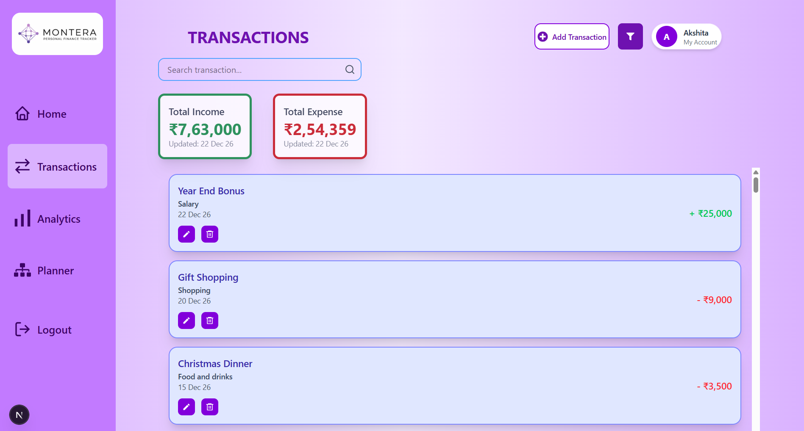
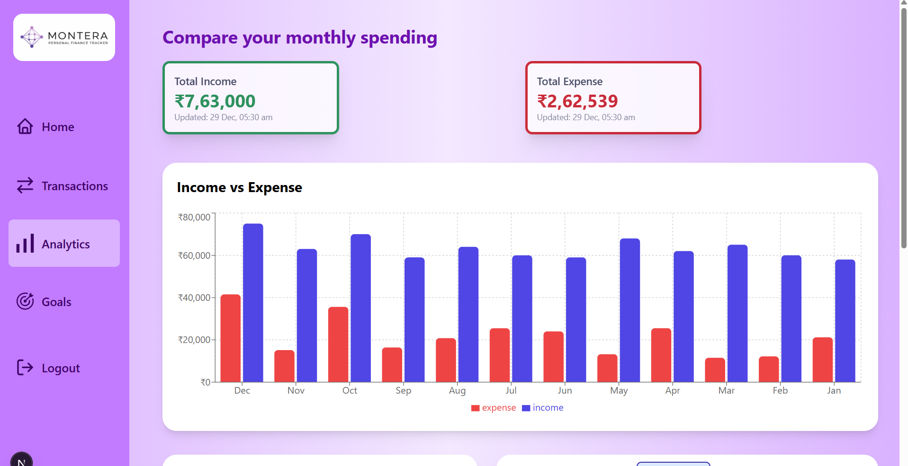
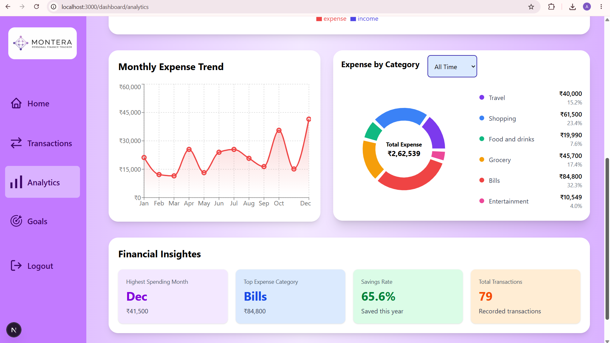
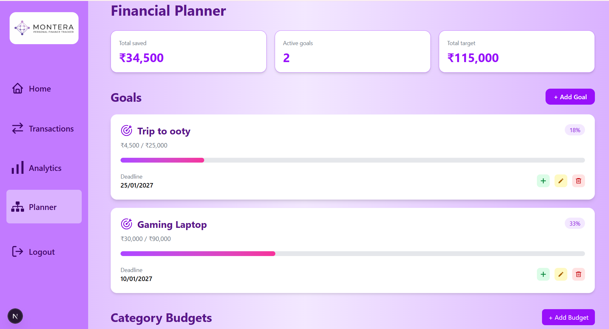
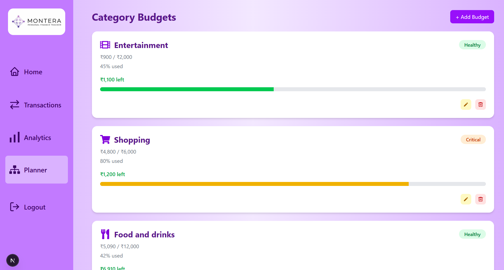
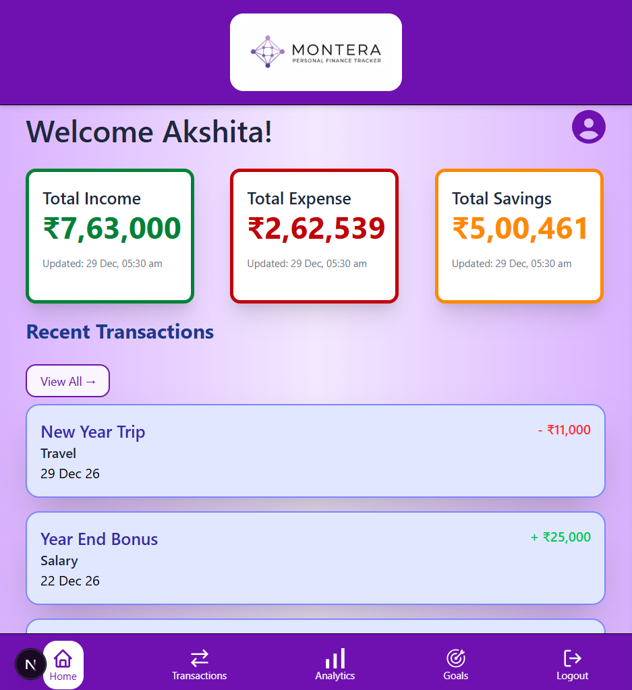
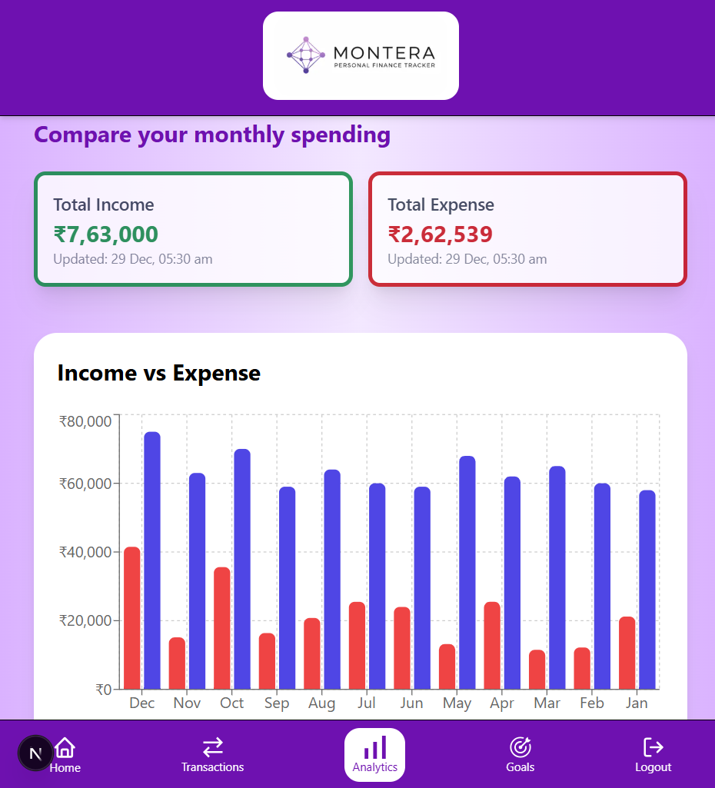

# Montera - Personal Finance Tracker

## Overview

Montera is a modern full-stack personal finance management application designed to help users monitor their income, expenses, budgets, and financial goals in one place. It provides interactive analytics, personalized financial insights, goal tracking, and budget planning through an intuitive and responsive interface.

The project was built to demonstrate full-stack development skills using the MERN ecosystem with secure authentication, RESTful APIs, data visualization, and responsive UI design.

## Features

### Authentication
- Secure JWT-based authentication
- Protected routes
- User-specific financial data

### Dashboard
- Financial summary cards
- Recent transactions
- Budget overview
- Quick navigation

### Transaction Management
- Add, edit, and delete transactions
- Search transactions
- Category filtering
- Income & expense tracking

### Analytics
- Income vs Expense charts
- Expense distribution (Pie Chart)
- Spending trends
- Financial insights

### Financial Planner
- Savings goals
- Budget management
- Goal progress tracking
- Add savings to goals

### User Experience
- Responsive design
- Loading skeletons
- Button loading states
- Empty states for new users
- Toast notifications

## Tech Stack

Frontend
- Next.js
- React
- Tailwind CSS

Backend
- Node.js
- Express.js

Database
- MongoDB

Authentication
- JWT

## Screenshots

### Landing page



### Dashboard



### Transactions



### Analytics





### Planner






## Responsive design
Montera is fully responsive and optimized for desktops, tablet and mobile devices

### Desktop Experience

- Responsive sidebar navigation
- Optimized card layout
- Wide chart visualization


---

### Mobile Experience

- Bottom navigation for quick access
- Mobile optimized dashboard
- Responsive transaction cards
- Adaptive analytics layout

| Mobile Dashboard | Mobile Analytics |
|------------------|----------|
|  |  |


## Project Structure

```text
Finance-tracker/
|
├─backend/
|  ├─config/
|  ├─controllers/
|  ├─middleware/
|  ├─models/
|  ├─routes/
|  ├─seedTransaction.js
|  ├─server.js
|  └─package.json
|
├─frontend/
|  └─finance-management-app/
|    ├─public/
|    ├─src/
|    | └─app/
|    |   ├─assets/
|    |   ├─components/
|    |   ├─dashboard/
|    |   |  ├─analytics/
|    |   |  ├─planner/
|    |   |  └─transactions/
|    |   ├─login/
|    |   ├─signup/
|    |   ├─global.css
|    |   ├─layout.js
|    |   └─page.js
|    ├─package.json
|    └─next.config.mjs
| 
├─Screenshots/
└─README.md

```
### Folder Overview

- **backend/** → REST APIs, authentication, database models, and business logic.
- **frontend/** → Next.js application with responsive UI.
- **components/** → Reusable UI components shared across pages.
- **dashboard/** → Main finance overview.
- **transactions/** → Manage income and expenses.
- **analytics/** → Charts and financial insights.
- **Screenshots/** → Images used in this README.

## Installation

### 1. Clone the repository

```bash
git clone https://github.com/vaishakshita/Finance-tracker.git
cd Finance-tracker
```

### 2. Install Backend Dependencies

```bash
cd backend
npm install
```

### 3. Install Frontend Dependencies

```bash
cd ../frontend/finance-management-app
npm install
```

### 4. Configure Environment Variables

Create a `.env` file inside the **backend** folder.

```env
MONGO_URI=your_mongodb_connection_string
JWT_SECRET=your_secret_key
PORT=5000
```

Replace the placeholder values with:

- **MONGO_URI** → Your MongoDB Atlas connection string
- **JWT_SECRET** → A secure random secret key used for signing JWTs.
- **PORT** → Backend server port (default: `5000`).

### 5. Start Backend Server

```bash
cd backend
npm run dev
```

### 6. Start Frontend

Open new terminal

```bash
cd frontend/finance-management-app
npm run dev
```

Visit:

```
http://localhost:3000
```

## Usage

After starting both the frontend and backend servers:

- Create a new account or log in using existing credentials.
- Add income and expense transactions.
- View recent transactions on the dashboard.
- Analyze spending patterns through interactive charts.
- Filter analytics by month to gain financial insights.
- Manage all transactions from the Transactions page.

## Authentication 

Montera uses **JWT (JSON Web Token)** for secure user authentication.

Authentication flow

1. User logs in with email and password.
2. Password is verified using **bcrypt**.
3. A JWT is generated upon successful authentication.
4. The token is stored in the browser for authenticated requests.
5. Protected API routes validate JWTs before granting access to user-specific resources.

> **Note:** For simplicity, the current implementation stores JWT in localStorage. In a production environment, HttpOnly cookies are recommended for enhanced security.

## REST API

### Authentication
POST /api/auth/signup

POST /api/auth/login

GET /api/auth/me

### Transactions
GET /api/transactions

POST /api/transactions

PUT /api/transactions/:id

DELETE /api/transactions/:id

### Goals
GET /api/goals

POST /api/goals

PUT /api/goals/:id

DELETE /api/goals/:id

### Budgets
GET /api/budget

POST /api/budget

PUT /api/budget/:id

DELETE /api/budget/:id

## Challenges

Some key challenges while building Montera included:

- Designing a responsive dashboard for desktop and mobile.
- Managing user authentication securely using JWT.
- Building reusable modal components.
- Implementing loading states and skeleton screens.
- Organizing the project into reusable components for scalability.

## Deployment

Frontend:
Vercel

Backend:
Render

Database:
MongoDB Atlas

## Live Demo

Frontend:
https://montera-self.vercel.app/

Backend:
https://montera-backend.onrender.com/

## Future Enhancements

- AI - powered monthly financial summaries.
- Smart spending recommendations
- Export transaction as CSV/PDF
- Dark mode support

## Author

**Akshita Vaish**

Software Engineering Student
Github: https://github.com/vaishakshita